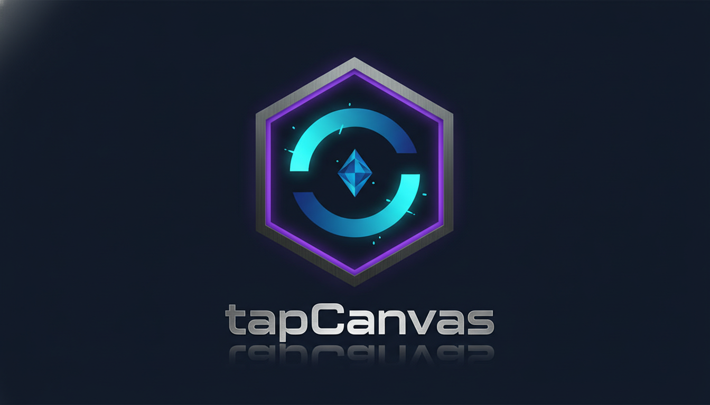
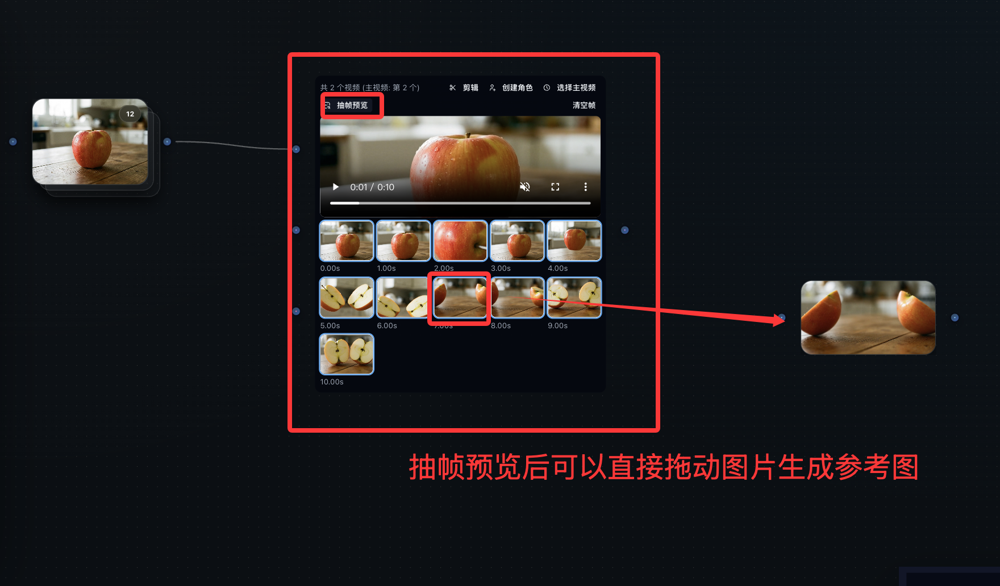

<p align="center">
  
</p>

<h1 align="center">TapCanvas</h1>

TapCanvas is a multi-model AI content creation platform built around a visual canvas: orchestrate text, image, video and other generation workflows in one place, with fast iteration across multi-step creative pipelines.

**Language:** [中文](README.md) | English

## Latest Capabilities

- **Video-to-image reference via frame preview**: drag a frame from the video preview directly onto the canvas to use it as a reference image for image generation.

<p align="center">
  
</p>

## HeyRoute referral credit

[Register through our HeyRoute referral link](https://heyroute.ai/r/c/ch_iiq2tvtmrc) to claim **$15 in credits** for Codex, Claude and Gemini chat and the platform's image generation services (eligibility and model availability are subject to HeyRoute's terms).

Seven built-in HeyRoute channels provide 31 models: 15 chat models (Claude, GPT, Grok, Gemini and Kimi), five image models and 11 video models (Grok, MiniMax H3 and Seedance), with per-channel pricing. In the new-api channel list or editor, click **Apply for API Key**, register through the link above, enter your own key and enable the desired channels. New channels start disabled with empty keys; upgrades preserve existing credentials and status. See the [initialization SQL](apps/new-api/patches/2026-09-11/004-expand-heyroute-channels.sql) and [integration notes](apps/new-api/docs/heyroute.md).

## Quick Start

### Local dev (recommended)

```bash
# 1) Install deps
pnpm install

# 2) Configure env
cp apps/web/.env.example apps/web/.env
cp apps/hono-api/.env.example apps/hono-api/.env

# 3) Start (two terminals)
pnpm dev:web
pnpm dev:api
```

`pnpm install` now bootstraps the workspace and generates the Prisma client for `apps/hono-api` automatically. If your environment hits file watcher limits with `pnpm dev:api`, use `pnpm dev:api:stable`.

### One-command full stack (Docker)

The `docker-compose.yml` lives in `apps/hono-api`. Run it from there to start the entire backend stack in one command:

```bash
cd apps/hono-api
docker compose up -d
```

This starts:
- `postgres` — database
- `redis` — cache
- `agents-bridge` — AI chat bridge
- `api` — backend API (`http://localhost:8788`)
- `new-api` — model gateway (`http://localhost:4455`)

Then start the web frontend separately (from the repo root):

```bash
pnpm dev:web
```

Copy env files if you haven't already:

```bash
cp apps/web/.env.example apps/web/.env
cp apps/hono-api/.env.example apps/hono-api/.env
# Then restart if needed
docker compose restart
```

## Architecture / Tech Stack

- **Monorepo**: pnpm workspaces (`apps/`, `packages/`)
- **Web**: Vite + React 18 + TypeScript, Mantine UI, React Flow canvas, Zustand state
- **API**: NestJS (Node.js) + Hono (route reuse), OpenAPI 3.1 + request validation
- **Storage**: SQLite (local), S3-compatible optional for asset hosting

## Environment

- Web (Vite): `apps/web/.env*`
- API: `apps/hono-api/.env` (or `apps/hono-api/.dev.vars`)
- Root `.env.example` is optional (scripts/tools only)

## Verify

- Web: `http://localhost:5173`
- API: `http://localhost:8788`
- API docs: `http://localhost:8788/`

## Docs

- `docs/README.md` (index)
- `docs/docker.md` (Docker)
- `docs/development.md` (local dev)
- `docs/INTELLIGENT_AI_IMPLEMENTATION.md` (AI tool contracts)
- `docs/AI_VIDEO_REALISM_GUIDE.md` (prompt tips)

## TODO / Roadmap

- **Sora 2 watermark removal**: smarter cleanup for generated videos
- **Video stitching**: seamless multi-clip concatenation + transitions
- **Basic video editing**: trim/split/merge inside TapCanvas

## Built with TapCanvas

Open-source projects built on top of TapCanvas:

| Project | Description |
| --- | --- |
| [JarvisHub](https://github.com/LYL1015/JarvisHub) | An Open Harness for Canvas-Native Multimodal Creative Agents. Treats an editable canvas as shared project state between people and agents for long-horizon creative work (narrative media, interactive web dev, deck generation), with Skills / Memory / Subagents and a bundled Trace Viewer. Apache-2.0. |

> Built something on TapCanvas? Open a PR or issue to get listed here.

## Contributing

- Issues: https://github.com/anymouschina/TapCanvas/issues
- Discussions: https://github.com/anymouschina/TapCanvas/discussions

## License

MIT

This project has been forked as the TapCanvas **Community Edition**: only non-commercial capabilities will be updated going forward. From open source, for open source.

> **Disclaimer**: The online website is the TapCanvas **Commercial Edition**, which is a separate product from the Community Edition in this repository — they differ in features and scope of service. This license applies only to the code in this repository, not to the online website.
